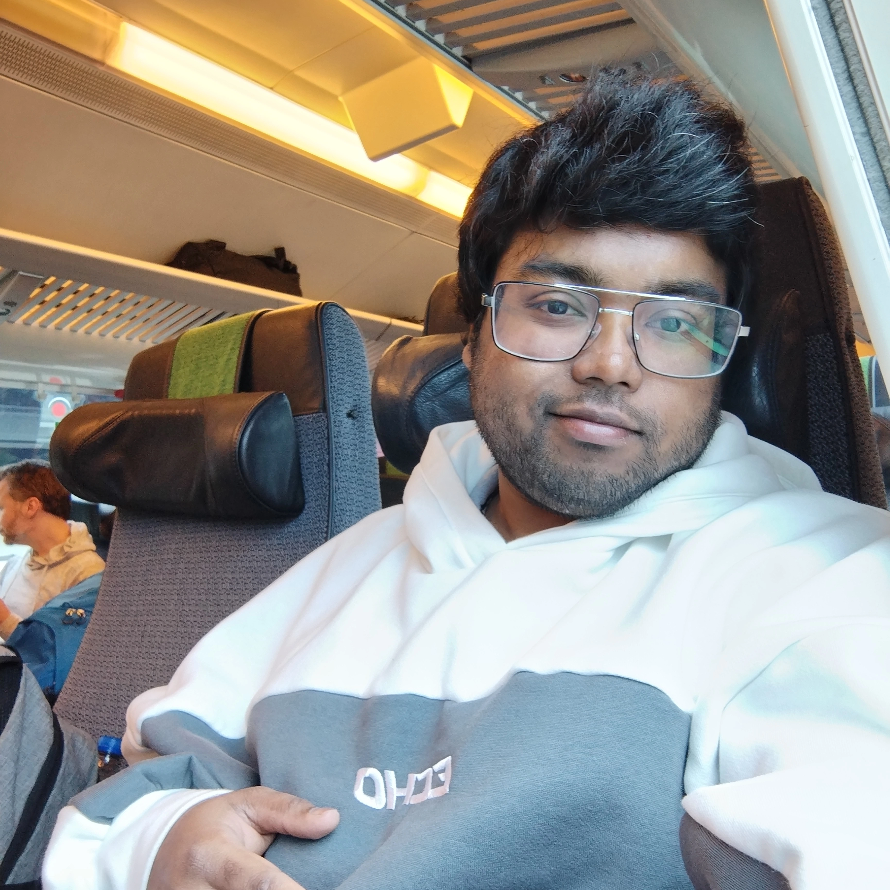

# Ahnaf Tahmid — Portfolio

A 3D interactive portfolio website with Three.js visuals, an AI chatbot, and image/video upload slots.

---

## 📁 Folder Structure

```text
Ahnaf's portfolio/
├── index.html              ← The main HTML file (open this in a browser)
├── README.md               ← This file
├── css/
│   ├── main.css            ← All main styles (layout, components, responsive)
│   └── chatbot.css         ← Chatbot panel styles
├── js/
│   ├── main.js             ← Scroll reveal, file uploads, 3D tilt
│   ├── background.js       ← 3D particle background
│   ├── hero-robot.js       ← Hero section 3D robot
│   ├── skills-scenes.js    ← 6 x 3D skill scenes
│   └── chatbot.js          ← AI chatbot logic
└── media/
    └── (put your photos / videos here)
```

Clean separation by language — HTML in `.html`, CSS in `/css`, JS in `/js`, media in `/media`. Easy to maintain.

---

## 🚀 Quick Deploy (5 minutes)

### Option 1: GitHub Pages (FREE — Recommended)

1. Create a new GitHub repo named exactly `AhnafTahmid98.github.io`
2. Upload **the entire folder contents** (index.html + css/ + js/ + media/) to the repo
3. Go to **Settings → Pages**
4. Source: `main` branch / root folder → **Save**
5. Your site goes live at **<https://ahnaftahmid98.github.io>**

### Option 2: Netlify (also FREE)

1. Go to [netlify.com/drop](https://app.netlify.com/drop)
2. Drag the **entire portfolio folder** onto the page
3. You get a URL like `https://your-name.netlify.app`

### Option 3: Vercel (also FREE)

1. Go to [vercel.com/new](https://vercel.com/new)
2. Import the GitHub repo or drag & drop the folder
3. Deploy

---

## 🖼️ Adding Your Photos and Videos

### Option A: Click-to-upload (works now, resets on refresh)

Open your site, click any upload slot, choose a file. It shows immediately — but only in that browser session.

### Option B: Make them permanent (recommended for live site)

1. Put your files in the `media/` folder:

   ```text
   media/
   ├── profile.jpg
   ├── robot-savo-demo.mp4
   ├── robot-savo.jpg
   ├── health-monitor.jpg
   └── llm-server.png
   ```

2. In `index.html`, find the upload slot you want to replace. For example, to replace the About Me photo slot, find:

   ```html
   <div class="vslot" onclick="trig('introF')">
     <input type="file" id="introF" accept="image/*" ...>
     ...
   </div>
   ```

3. Replace the whole `<div class="vslot">...</div>` with:

   ```html
   <div class="vslot" style="cursor:default">
     
   </div>
   ```

4. For videos, use:

   ```html
   <div class="vslot" style="cursor:default">
     <video src="media/robot-savo-demo.mp4" controls style="display:block;opacity:1"></video>
   </div>
   ```

---

## 🤖 Setting Up the AI Chatbot

The chatbot needs a backend proxy to securely call the Claude API. **Never put your API key in the HTML** — others would steal it.

### Easiest option: Cloudflare Workers (FREE)

1. **Get an Anthropic API key** at [console.anthropic.com](https://console.anthropic.com/)

2. Go to [workers.cloudflare.com](https://workers.cloudflare.com/) and sign up (free)

3. Create a new Worker and paste this code:

```javascript
export default {
  async fetch(request, env) {
    // CORS preflight
    if (request.method === 'OPTIONS') {
      return new Response(null, {
        headers: {
          'Access-Control-Allow-Origin': '*',
          'Access-Control-Allow-Methods': 'POST',
          'Access-Control-Allow-Headers': 'Content-Type',
        },
      });
    }

    const body = await request.json();

    const response = await fetch('https://api.anthropic.com/v1/messages', {
      method: 'POST',
      headers: {
        'Content-Type': 'application/json',
        'x-api-key': env.ANTHROPIC_API_KEY,
        'anthropic-version': '2023-06-01',
      },
      body: JSON.stringify({
        model: 'claude-sonnet-4-20250514',
        max_tokens: 500,
        system: body.system,
        messages: body.messages,
      }),
    });

    const data = await response.json();
    const reply = data.content?.filter(b => b.type === 'text').map(b => b.text).join('\n').trim() || '';

    return new Response(JSON.stringify({ reply }), {
      headers: {
        'Content-Type': 'application/json',
        'Access-Control-Allow-Origin': '*',
      },
    });
  },
};
```

1. In the Worker's **Settings → Variables**, add:
   - Name: `ANTHROPIC_API_KEY`
   - Value: your Anthropic API key (click "Encrypt")

2. Save and deploy. You'll get a URL like `https://portfolio-chat.your-name.workers.dev`

3. **Open `js/chatbot.js`** and change this line (near the top):

   ```javascript
   const CHATBOT_ENDPOINT = "YOUR_BACKEND_URL_HERE";
   ```

   to your Worker URL:

   ```javascript
   const CHATBOT_ENDPOINT = "https://portfolio-chat.your-name.workers.dev";
   ```

4. Redeploy your portfolio. Chatbot now works! 🎉

---

## 🎨 Customizing

### Change the accent color

Open `css/main.css`, find `:root {`, and change:

```css
--accent: #ff5722;   /* main orange */
--accent2: #ff8a65;  /* lighter hover */
```

### Update the chatbot knowledge

Open `js/chatbot.js`, find the `AHNAF_CONTEXT` constant, and edit what the bot knows about you.

### Add a new project

Open `index.html`, find the `<div class="proj-list">` section. Copy any `.pj.standard` block and edit its content.

---

## 🛠 Tech Stack

- **Pure HTML / CSS / JS** — no frameworks, no build step
- **Three.js** (CDN) — for all 3D scenes
- **Google Fonts** — Instrument Serif, Inter, JetBrains Mono
- **Anthropic Claude API** (optional) — for the chatbot

---

## 📬 Contact

- **Email:** <ahnaftahmid40@gmail.com>
- **GitHub:** [@AhnafTahmid98](https://github.com/AhnafTahmid98)
- **LinkedIn:** [ahnaf-tahmid98](https://linkedin.com/in/ahnaf-tahmid98)

---

Built with ● precision.
